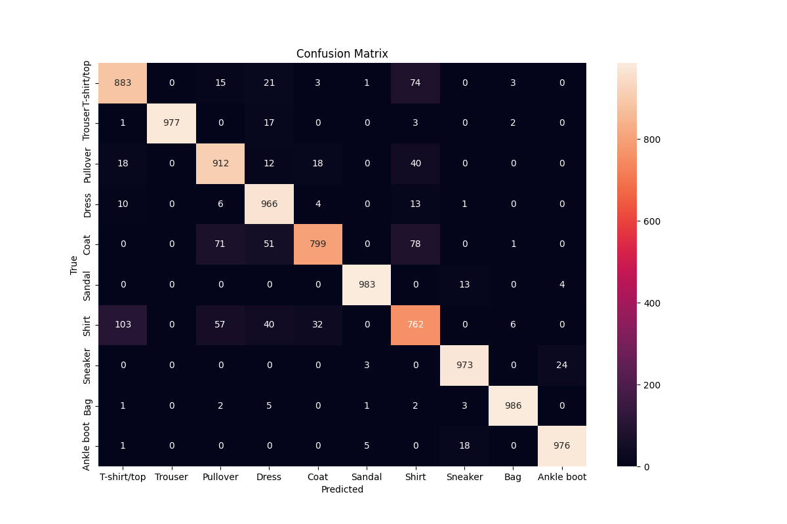

# FashionMNIST CNN with PyTorch and Optuna

This project trains a Convolutional Neural Network (CNN) on the FashionMNIST dataset using PyTorch. Hyperparameter optimization is performed using Optuna, and TensorBoard is used to track the training process. Additionally, the model's performance is visualized and evaluated through confusion matrices and accuracy reports.

## Project Overview

1. **Dataset**: FashionMNIST dataset containing 10 classes of grayscale images of clothing items.
2. **Model**: CNN architecture with two convolutional layers, max pooling, dropout, and two fully connected layers.
3. **Optimization**: Optuna is used for hyperparameter tuning, focusing on:
   - Number of filters in convolutional layers
   - Number of units in the fully connected layer
   - Dropout rate
   - Learning rate
   - Batch size
4. **Visualization**: Matplotlib is used to display some results, and TensorBoard is used for tracking the training process.
5. **Evaluation**: The model's performance is evaluated using accuracy metrics, per-class accuracy, and confusion matrices.

## Key Features

### Model Architecture

The CNN has the following layers:
- Two convolutional layers with ReLU activations followed by max-pooling.
- A fully connected layer with ReLU and dropout.
- Output layer using softmax for 10-class classification.

### Hyperparameter Optimization

Optuna optimizes key hyperparameters such as:
- Number of filters in convolutional layers (`conv1_filters`, `conv2_filters`)
- Number of units in fully connected layers (`fc_units`)
- Dropout rate (`dropout_rate`)
- Learning rate (`lr`)
- Batch size (`batch_size`)

The objective function uses cross-entropy loss and Adam optimizer.

### TensorBoard Logging

- Training loss and accuracy are logged at each epoch.
- The results can be visualized in TensorBoard.

### Visualizing Model Predictions

You can visualize the model's predictions and compare them to the ground truth using `matplotlib`:
- Display predicted vs. true labels for sample images from the test set.
- Confusion matrix for better understanding of model performance across classes.

## How to Use

### Install

- You can install the environment using the provided environment.yml file.
    
```bash
conda env create -f environment.yml
conda activate ml
```
### Run

1. **Train the Model**: The model is trained on the FashionMNIST dataset with the hyperparameters found by Optuna.
2. **Visualize Results**: Use `visualize_results()` to visualize predictions on test data.
3. **Evaluate**: The final model is evaluated on the test set, displaying accuracy for each class and the overall performance.

## Visualization of Results

Use the `imshow()` function to display images, and the `visualize_results()` function to display the predicted and true labels for the first 16 images of the test set.

Additionally, confusion matrices are plotted using `seaborn` to give a detailed view of how the model performs across different classes.

## Results
### Hyperparameter Optimization Summary

| Parameter         | Value                         |
|-------------------|-------------------------------|
| conv1_filters      | 32                            |
| conv2_filters      | 128                           |
| fc_units           | 128                           |
| dropout_rate       | 0.250                         |
| learning_rate (lr) | 0.000267                      |
| batch_size         | 32                            |

### Training and Validation Performance

| Epoch | Training Loss | Validation Accuracy (%) |
|-------|---------------|-------------------------|
| 1     | 0.299         | 91.13                    |
| 2     | 0.099         | 92.55                    |
| 3     | 0.090         | 93.17                    |
| 4     | 0.351         | 93.95                    |
| 5     | 0.220         | 95.43                    |
| 6     | 0.021         | 96.02                    |
| 7     | 0.080         | 97.05                    |
| 8     | 0.036         | 97.42                    |
| 9     | 0.236         | 98.00                    |
| 10    | 0.244         | 97.35                    |

### Final Model Evaluation

- Overall Accuracy: 92 %

